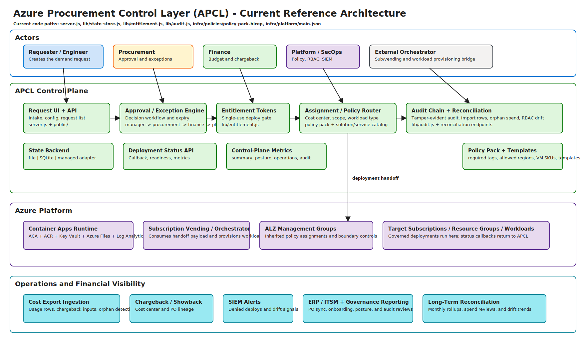

# Azure Procurement Control Layer (APCL)

APCL is a procurement-aware Azure governance control plane starter.

It helps enterprises enforce this chain for Azure consumption:

1. request
2. approval
3. entitlement
4. deployment
5. policy compliance
6. cost reconciliation
7. finance visibility

This repository includes a working local control-plane app, Azure governance templates, and operational scripts you can adapt to your internal environment.

## Architecture diagram



Editable source: `assets/apcl-architecture.excalidraw`

## Disclaimer

This is a personal project by Sudhakar Ethirajulu.
It is not an official Microsoft offering and is not endorsed, supported, or warranted by Microsoft.
All trademarks and product names are the property of their respective owners.

## Start here (clone -> run in minutes)

```powershell
git clone https://github.com/sethiramicrosoft/azure-procurement-control-layer.git
cd azure-procurement-control-layer
npm install
npm start
```

Open `http://localhost:3000`.

Then set control-plane defaults in the **Control plane inputs** form:
- manager/procurement/finance approver emails
- default budget cap
- budget thresholds
- default exception duration

### Optional: run in Docker

```powershell
docker build -t apcl:latest .
docker run -p 3000:3000 -e APCL_ENTITLEMENT_SECRET="<strong-secret>" apcl:latest
```

## Deploy directly to Azure (no local deployment required)

This path provisions APCL runtime infrastructure in Azure and deploys the application container.

### Prerequisites

- Azure CLI logged in (`az login`)
- permissions to create resource groups and deploy resources in target subscription
- Bicep support in Azure CLI (`az bicep version`) for Bicep deployments
- or use the generated ARM template (`infra/platform/main.json`)

### 1. Provision APCL platform in Azure

Using Bicep (default):

```powershell
./scripts/deploy-platform.ps1 -SubscriptionId <sub-id> -ResourceGroupName rg-apcl-platform-prod -Location australiaeast -ContainerAppName aca-apcl-prod -ContainerAppEnvironmentName cae-apcl-prod -LogAnalyticsWorkspaceName law-apcl-prod -ContainerRegistryName <globally-unique-acr-name> -KeyVaultName <globally-unique-kv-name> -EasyAuthTenantId <tenant-id> -EasyAuthClientId <app-client-id> -EasyAuthClientSecret "<app-client-secret>"
```

Using ARM template output:

```powershell
./scripts/deploy-platform.ps1 -SubscriptionId <sub-id> -ResourceGroupName rg-apcl-platform-prod -Location australiaeast -ContainerAppName aca-apcl-prod -ContainerAppEnvironmentName cae-apcl-prod -LogAnalyticsWorkspaceName law-apcl-prod -ContainerRegistryName <globally-unique-acr-name> -KeyVaultName <globally-unique-kv-name> -TemplateType ARM -EasyAuthTenantId <tenant-id> -EasyAuthClientId <app-client-id> -EasyAuthClientSecret "<app-client-secret>"
```

`deploy-platform.ps1` now configures the Container Apps auth provider boundary (not just app env vars) by default:

1. Enables auth with unauthenticated action `Return401`
2. Configures Microsoft identity provider (tenant, client id, client secret, issuer, allowed audience)
3. Synchronizes APCL runtime allowlist env vars (`APCL_EASYAUTH_ALLOWED_APP_IDS`, `APCL_EASYAUTH_ALLOWED_TENANT_IDS`)

If you update `infra/platform/main.bicep`, regenerate ARM output:

```powershell
./scripts/build-arm-from-bicep.ps1
```

### 2. Build and deploy APCL app container

```powershell
./scripts/deploy-app-to-aca.ps1 -SubscriptionId <sub-id> -ResourceGroupName rg-apcl-platform-prod -ContainerAppName aca-apcl-prod -ContainerRegistryName <globally-unique-acr-name>
```

### 3. Validate

Use the URL printed by the deployment script and open:

- `https://<apcl-fqdn>/`
- `https://<apcl-fqdn>/api/health`
- `https://<apcl-fqdn>/api/readiness`

### Customer customization

- ingress restrictions (public/internal)
- APCL deployment mode (`local` vs `webhook`)
- APCL webhook endpoint for vending/orchestration integration
- webhook request signing secret (`APCL_DEPLOYMENT_WEBHOOK_HMAC_SECRET`)
- callback status token (`APCL_DEPLOYMENT_STATUS_TOKEN`)
- scaling and resource sizing
- security boundaries (networking, RBAC, Key Vault policies)
- APCL auth mode (`none`, `easyauth`, `static`) and role mapping

### Identity and role enforcement

APCL now supports role-gated APIs using authentication modes:

- `APCL_AUTH_MODE=none` (local demo only)
- `APCL_AUTH_MODE=easyauth` (recommended for Azure-hosted deployments with Entra/EasyAuth)
- `APCL_AUTH_MODE=static` (non-production integration testing with static bearer token map)

EasyAuth hardening options:

- `APCL_EASYAUTH_ALLOWED_APP_IDS=<comma-separated app ids / audiences>` to reject tokens from unapproved clients.
- `APCL_EASYAUTH_ALLOWED_TENANT_IDS=<comma-separated tenant ids>` to reject tokens from unapproved tenants.
- `APCL_EASYAUTH_GROUP_ROLE_MAP_JSON='{"<group-id>":["requester","procurement"]}'` to map Entra groups to APCL roles.
- `APCL_APPROVER_GROUPS_JSON='{"manager":["<group-id>"],"procurement":["<group-id>"],"finance":["<group-id>"],"platform":[]}'` to enforce approver authority by group claim (not only email).

Required role families:

- `requester` for request submission/update
- `procurement` for approvals, exceptions, entitlements, assignment
- `deployer` for deployment actions and run-state callbacks
- `finance` for reconciliation operations
- `security`/`platform` for RBAC drift and platform config

`APCL_AUTH_MODE=none` and default entitlement secret are blocked when `NODE_ENV=production`.

Approval authority enforcement:

- Approval decisions require the configured procurement approver identity (unless `platform` role).
- Exception decisions, assignment, and entitlement issuance require procurement approver authority (unless `platform` role).
- Requester-initiated exception requests are constrained to the request owner identity.

### Durable state and audit export

APCL supports pluggable state backends:

- `APCL_STATE_BACKEND=file` (default demo mode)
- `APCL_STATE_BACKEND=sqlite` (transactional snapshot persistence with optimistic write conflict checks)

SQLite path can be configured with:

- `APCL_SQLITE_DB_PATH=<path-to-apcl.db>`

For append-only external audit stream export:

- `APCL_AUDIT_EXPORT_PATH=<path-to-audit-export.jsonl>`
- `APCL_AUDIT_EXPORT_SECRET=<hmac-secret-for-export-signatures>` (optional but recommended)

Webhook integration hardening:

- `APCL_DEPLOYMENT_WEBHOOK_HMAC_SECRET=<shared-secret>`
- APCL signs webhook payload with:
  - `x-apcl-timestamp`
  - `x-apcl-signature` (`HMAC_SHA256(secret, "<timestamp>.<raw-json-body>")`)
- `APCL_DEPLOYMENT_STATUS_TOKEN=<shared-callback-token>`
- Orchestrator callback can call `POST /api/deployments/{id}/status` using header `x-apcl-status-token`.
- Invalid callback status tokens are rejected with `401`.
- Deployment execution status transitions are monotonic (`queued -> running -> succeeded/failed`; terminal states cannot regress).
- APCL webhook trigger now supports retry/timeouts:
  - `APCL_DEPLOYMENT_WEBHOOK_TIMEOUT_MS` (default `10000`)
  - `APCL_DEPLOYMENT_WEBHOOK_RETRY_COUNT` (default `2`)
  - `APCL_DEPLOYMENT_WEBHOOK_RETRY_DELAY_MS` (default `500`)
- Optional external run polling:
  - `APCL_DEPLOYMENT_POLL_ENABLED=true`
  - `APCL_DEPLOYMENT_POLL_URL_TEMPLATE=https://orchestrator/api/runs/{runId}`
  - `APCL_DEPLOYMENT_POLL_INTERVAL_MS` and `APCL_DEPLOYMENT_POLL_MAX_ATTEMPTS`
  - `APCL_DEPLOYMENT_POLL_BEARER_TOKEN` (optional)
- Deployment requests support idempotency replay using header `idempotency-key` (configurable with `APCL_DEPLOYMENT_IDEMPOTENCY_HEADER`).

Governance lock-down option:

- `APCL_ENFORCE_DEPLOYER_ALLOWLIST=true`
- `APCL_ALLOWED_DEPLOYER_IDENTITIES=<comma-separated deployer identities>`

When enabled, only listed deployer identities (or `platform` role) can call `/api/requests/{id}/deploy`.

Production guardrails now enforce:

1. `APCL_DEPLOYMENT_MODE=webhook`
2. webhook signing + callback token configured
3. deployer allowlist enabled with at least one identity
4. EasyAuth app allowlist configured when `APCL_AUTH_MODE=easyauth`
5. EasyAuth tenant allowlist configured
6. persistent non-`/tmp` paths for state and audit export
7. audit export secret configured

## Validation tests

Run automated smoke/regression checks:

```powershell
npm test
```

CI pipeline (`.github/workflows/ci.yml`) runs:

1. `node --check server.js`
2. `npm test`
3. `az bicep build --file infra/platform/main.bicep`

## Why APCL exists

Most procurement operating models are PO-first and pre-approved.
Azure is consumption-first and engineer-triggered.

That mismatch creates common enterprise risks:

- spend created before procurement approval
- weak attribution (cost center / PO / owner)
- delayed visibility (invoice-time surprises)
- fragmented controls across subscriptions/tenants

APCL addresses this by making deployment permission conditional on approved intent.

## What APCL does today

### Implemented in this repo

- Request intake API + UI with procurement metadata.
- Configurable control-plane inputs (approver emails, budget cap, budget thresholds, exception duration).
- Approval/rejection workflow.
- Exception workflow (request, approve/reject, expiry).
- Entitlement token issuance for approved/exception-approved requests.
- Deployment API enforcement (valid APCL token required).
- Single-use entitlement consumption.
- Tamper-evident audit hash chain (`prevHash` + `hash`).
- Reconciliation import endpoint with orphan spend detection.
- Azure Policy baseline (required tags, allowed regions, allowed VM SKUs).
- Sample approved VM Bicep template.
- RBAC hardening baseline script.
- Assignment policy mapping (cost center -> subscription + resource group prefix + budget cap).
- Deployment execution adapter (`local` or `webhook`) for external orchestrators.
- RBAC drift reporting endpoint for high-privilege human role detection.

### External integrations not included in-repo

- Live SAP/ERP APIs.
- Live ServiceNow/ITSM APIs.
- Entra PIM configuration automation.
- SIEM ingestion pipelines.
- Tenant-scale onboarding automation.

Those are intentionally outside this repo and should be wired to your internal systems.

## Reference flow

1. Engineer creates request with business and procurement metadata.
2. Manager/procurement decides approve/reject.
3. If approved (or valid approved exception exists), APCL issues entitlement token.
4. Deployment endpoint accepts only valid, unexpired, unused token.
5. Azure Policy denies non-compliant resource creation.
6. Cost rows are imported and matched to request lineage.
7. Orphan spend is surfaced for FinOps/procurement follow-up.

## Guardrail model

### Policy envelope

APCL policy envelope controls request admissibility and deployment boundaries:

- Required procurement metadata (`CostCenter`, `PO_ID`, `Owner`, `RequestId`).
- Allowed regions.
- Allowed VM SKUs for VM requests.
- Budget cap and threshold percentages by cost center.
- Assignment policy that maps approved requests to governed subscription/resource-group targets.

### Exception lane

APCL includes a formal exception lane with lifecycle controls:

1. Exception requested with reason and duration.
2. Procurement decision (approve/reject).
3. Approved exception gets explicit expiry.
4. Exception decisions are auditable and tied to request lineage.

### Auto-approval for standard patterns

APCL currently supports deterministic policy evaluation plus explicit approval decisions.

To enable full auto-approval, configure a standard-pattern rule set (in your adapter/orchestrator) that approves only when:

- policy checks pass,
- budget thresholds are within approved tolerance,
- request matches pre-approved service envelope (resource type/region/SKU),
- no exception is required.

This keeps approvals fast for routine requests while preserving strict controls for non-standard demand.

## Subscription vending + ALZ integration

### What is implemented now

- Assignment policy maps approved demand to target subscription and governed resource-group naming.
- Deployment adapter supports webhook mode to trigger your existing vending/orchestration system.
- Policy and tagging guardrails are deployable via included Bicep/scripts.

### What you wire in enterprise rollout

- Subscription vending platform integration (e.g., CAF-based vending pipeline).
- ALZ management-group hierarchy, policy initiatives, and RBAC baselines as the enforcement backbone.
- APCL request/approval outputs passed into vending pipeline inputs (subscription, environment, archetype, budget guardrails).

### Recommended integration pattern

1. APCL approves intent and returns entitlement + assignment context.
2. Vending/orchestrator consumes APCL payload and executes ALZ-aligned deployment.
3. Orchestrator posts run-state updates back to APCL (`POST /api/deployments/{executionId}/status`).
4. APCL stores execution status and reconciliation lineage for procurement/finance evidence.

## Enterprise scale enablement

For large estates, do not run one-off commands per subscription as the steady-state model.

Use this pattern:

1. Central APCL control plane for requests, approvals, exception handling, entitlement, and reconciliation.
2. Management-group-driven baseline rollout (bootstrap helper script in `scripts/bootstrap-at-management-group.ps1`).
3. Subscription vending integration for Day-0 onboarding with APCL context.
4. CI/CD-based fleet rollout and validation for policy and RBAC guardrails.
5. Scheduled reconciliation and RBAC drift reporting at fleet level.

See `docs/scale-rollout.md` for rollout phases and customer customization points.

## Reusable enterprise deployment pattern

Use this pattern as a direct starting point and adapt only the marked customization points.

### Pattern overview

1. **Control plane**: one APCL service per environment (dev/test/prod).
2. **Guardrails**: policy baseline rolled out at management-group scope.
3. **Vending**: APCL request/approval output flows into your subscription/workload vending orchestrator.
4. **Operations**: scheduled reconciliation and RBAC drift reporting.

### Standard implementation steps

1. Deploy APCL service runtime (App Service/Container Apps/VM) with strong entitlement secret.
2. Roll out policy baseline across management-group subscription fleet.
3. Configure APCL assignment policies (cost center -> subscription archetype + RG prefix + budget cap).
4. Wire deployment webhook mode to your vending/orchestration pipeline.
5. Schedule reconciliation imports and RBAC drift checks.

### Customer customization points

- management-group hierarchy and exemption model
- vending pipeline/toolchain (CAF accelerator, internal platform, Terraform/Bicep)
- approval matrix and auto-approval thresholds
- policy envelope (regions, SKUs, tags, exceptions)
- reconciliation source and chargeback model
- SIEM/PIM/security operations integrations

See `docs/enterprise-deployment-pattern.md` for a copy-ready runbook template.

## Prerequisites

### 1) Local runtime (for APCL control-plane app)

- Node.js 18+
- PowerShell 7+
- Optional Docker (for container run)

### 2) Azure governance deployment

- Azure subscription access for:
  - policy definition/assignment deployment
  - resource group creation
  - role assignment inspection
- Azure CLI (`az`) authenticated
- Bicep support in Azure CLI (`az bicep`) or generated ARM templates

### 3) Org readiness (for enterprise rollout)

- Cost center master data
- PO/commitment model
- Approval authority matrix (manager/procurement/finance)
- RBAC ownership model (platform/security/procurement)

## Quick start

### A. Local pilot bootstrap

1. Run APCL locally (`npm start`).
2. Create and decide a request in the UI.
3. Issue entitlement and execute deploy flow.
4. Run sample reconciliation:

```powershell
./scripts/invoke-reconciliation.ps1
```

### B. Azure guardrails bootstrap (single subscription)

```powershell
./scripts/bootstrap.ps1 -SubscriptionId <sub-id> -Location australiaeast -ResourceGroupName rg-apcl-governance
./scripts/deploy-approved-vm.ps1 -SubscriptionId <sub-id> -ResourceGroupName rg-apcl-approved-workloads -Location australiaeast -VmName vm-apcl-demo
./scripts/rbac-hardening-baseline.ps1 -SubscriptionId <sub-id>
```

### C. Azure guardrails bootstrap (management group / fleet)

```powershell
./scripts/bootstrap-at-management-group.ps1 -ManagementGroupId <mg-id> -Location australiaeast -ResourceGroupName rg-apcl-governance
```

This applies the APCL baseline policy pack across all subscriptions under the management group.

## Internal system integration guide

APCL is designed to connect to your internal systems through adapter APIs.

### Procurement / ITSM integration (recommended)

Use APCL as the control-plane API behind your existing front-door workflow.

- Source systems: ServiceNow, SAP, Dynamics, custom procurement portal.
- Integration pattern:
  1. system creates APCL request
  2. external approval decision posts to APCL decision endpoint
  3. external orchestrator calls entitlement + deploy
  4. reconciliation summaries are fed back to finance tooling

### Identity and access integration

- Keep broad Azure RBAC roles minimal.
- Use PIM for eligible elevation.
- Restrict deployment path to approved automation identities.
- Set strong secret for entitlement signing (`APCL_ENTITLEMENT_SECRET`).

### Finance / FinOps integration

- Import cost rows via reconciliation endpoint.
- Match by APCL request number and procurement metadata.
- Route orphan spend to remediation queue.

### Security / SOC integration

- Forward audit events to SIEM.
- Alert on:
  - denied deployments
  - repeated invalid entitlement attempts
  - exception approvals near expiry
  - orphan spend spikes

## API surface (high-level)

- `GET /api/health`
- `GET /api/readiness`
- `GET /api/summary`
- `GET|PUT /api/config`
- `GET /api/control-plane/status`
- `GET|POST /api/requests`
- `POST /api/requests/{id}/decision`
- `POST /api/requests/{id}/assign`
- `POST /api/requests/{id}/exception`
- `POST /api/requests/{id}/exception-decision`
- `POST /api/requests/{id}/entitlement`
- `POST /api/requests/{id}/deploy`
- `GET /api/deployments`
- `POST /api/deployments/{id}/status`
- `GET /api/governance/posture`
- `GET /api/operations/metrics`
- `POST /api/reconciliation/import`
- `GET /api/reconciliation/summary`
- `GET /api/audit`

See `docs/operations.md` for payload examples and operations details.
Incident response guide: `docs/incident-runbook.md`.

Governance lockdown helper:

```powershell
./scripts/governance-lockdown-baseline.ps1 -SubscriptionId <sub-id>
```

## Deployment options

### Local process

```powershell
npm start
```

### Container

```powershell
docker build -t apcl:latest .
docker run -p 3000:3000 -e APCL_ENTITLEMENT_SECRET="<strong-secret>" apcl:latest
```

### Enterprise deployment target patterns

- App Service / Container Apps for control plane
- Azure SQL/Cosmos (replace local JSON state)
- Key Vault for signing secrets
- CI/CD pipeline with environment isolation

## Production hardening checklist

- [ ] Replace file-based state with managed datastore.
- [ ] Configure Key Vault secret retrieval.
- [ ] Enable authentication and API authorization boundaries.
- [ ] Integrate PIM and privileged access governance.
- [ ] Wire SIEM and incident workflows.
- [ ] Integrate ERP/ITSM connectors.
- [ ] Define retention and audit export policy.
- [ ] Add backup/restore and DR runbooks.
- [ ] Deploy APCL runtime on Azure hosting (ACA/App Service) instead of local process for production.
- [ ] Set APCL entitlement secret only from Key Vault and rotate it on schedule.
- [ ] Restrict ingress and API exposure based on enterprise network/security policy.
- [ ] Set deployment mode to webhook and integrate with vending/orchestration pipeline.
- [ ] Use `APCL_STATE_BACKEND=sqlite` (or external managed datastore pattern) for durable runtime state.
- [ ] Enable append-only audit export via `APCL_AUDIT_EXPORT_PATH` (+ optional HMAC signing secret).

## Current maturity statement

This repo is a strong control-plane starter and pilot-ready accelerator.
It is not a complete enterprise product until your internal identity, ITSM/ERP, and SOC integrations are wired.

## FAQ (Procurement + IT + Platform)

### Procurement-facing

**Q: How does APCL help procurement in a consumption model where spend is post-usage?**  
A: APCL shifts control left by requiring approved intent (cost center, PO reference, owner, approvers) before deployment can proceed, then preserves lineage into reconciliation and chargeback.

**Q: Can APCL enforce PO-first behavior if Azure is self-service?**  
A: Yes. Requests without required procurement metadata fail policy evaluation, and deployments require APCL entitlement tied to approved procurement context.

**Q: How does APCL reduce invoice-time surprises?**  
A: It combines pre-deployment controls (policy + approvals + budget limits) with post-deployment reconciliation and orphan spend detection.

**Q: Does APCL replace ERP/ITSM systems?**  
A: No. It acts as the cloud control plane between engineering activity and procurement/finance systems, using adapters for your ERP/ITSM estate.

### IT / platform objection handling

**Q: “This will slow engineering down.”**  
A: APCL separates standard and non-standard demand. Standard patterns can be auto-approved through deterministic rules; non-standard requests use explicit approval/exception lanes.

**Q: “This adds admin overhead for cloud teams.”**  
A: APCL centralizes controls as reusable policy envelopes and assignment policies, reducing ad-hoc ticket handling and manual governance checks.

**Q: “We already have Azure Policy and RBAC — why APCL?”**  
A: Azure Policy/RBAC enforce technical boundaries, but APCL binds those boundaries to procurement intent, entitlement issuance, audit evidence, and reconciliation lineage.

**Q: “Will this conflict with ALZ and subscription vending?”**  
A: No. APCL is designed to front-end ALZ/vending workflows by supplying approved intent and guardrail context that downstream vending pipelines enforce at scale.

### Adoption and value

**Q: Who is the primary buyer/sponsor?**  
A: Procurement and FinOps co-sponsors, with platform/security as implementation owners.

**Q: What is the business case in one line?**  
A: APCL reduces uncontrolled cloud spend risk by turning procurement policy into enforceable pre-deployment controls with end-to-end financial traceability.

**Q: What is the fastest path to prove value?**  
A: Pilot one cost center and one subscription family, enable required metadata + entitlement gating + reconciliation import, then measure orphan spend and approval cycle improvements.

## Contributing

Contributions are welcome for:

- policy packs by regulatory profile
- enterprise integration adapters
- hardened persistence backends
- multi-tenant onboarding automation
